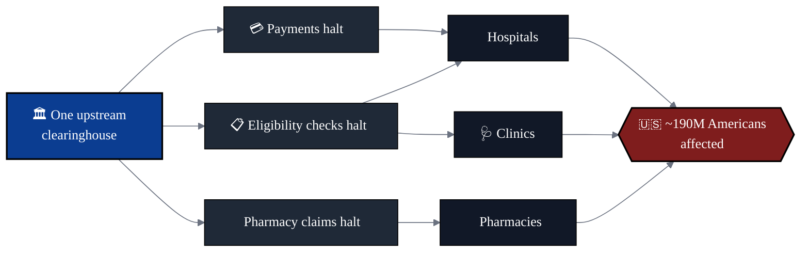
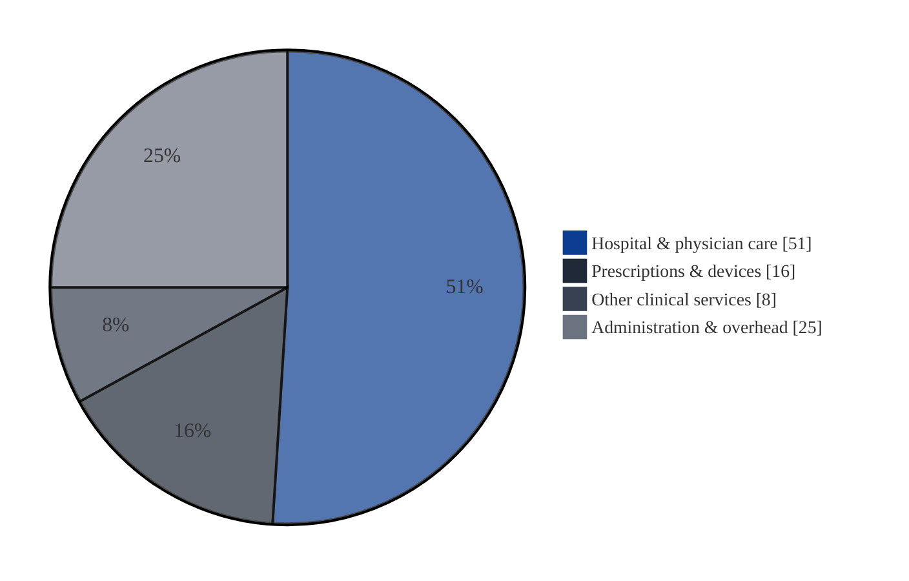

<picture>
  <source media="(prefers-color-scheme: dark)" srcset="assets/pangaea-wordmark-light.svg">
  
</picture>

 
 

### *One continent. One standard. One healthcare.*

 

 

# The infrastructure of American healthcare

# *is quietly on fire.*

 

*[↗ Open the .stl model](assets/explosion.stl) — GitHub renders it as an interactive 3D viewer.*

 

---

## ✦ &nbsp; The system was never designed.

It accreted. Forty years of acquisitions, regulations, vendor lock‑in, and 3 a.m. patches stacked into something that *technically* moves money and records — until it doesn't. The result is the most expensive healthcare apparatus on earth, and one of the most fragile.

 

<table align="center">
<tr>
<td align="center" width="33%">
<h1>$4.9T</h1>
U.S. HEALTHCARE SPEND, ANNUALLY<a href="#fn-cms-nhe">[1]</a>
  
≈ <b>17.6% of GDP</b> — more than education, defense, and energy <i>combined</i>.<a href="#fn-cms-share">[2]</a>
</td>
<td align="center" width="34%">
<h1>725M+</h1>
PATIENT RECORDS BREACHED SINCE 2010<a href="#fn-ocr-portal">[3]</a>
  
A single industry has lost more PHI than the population of the United States — <b>twice</b>.
</td>
<td align="center" width="33%">
<h1>1 in 4</h1>
DOLLARS SPENT ON ADMIN — NOT CARE<a href="#fn-admin">[4]</a>
  
The largest line item in the world's largest healthcare system is <b>overhead</b>.
</td>
</tr>
</table>

---

## ✦ &nbsp; The price of fragility

*Six numbers that should not exist in a functioning supply chain.*

 

<table align="center">
<tr>
<td align="center" width="28%">
<h1><code>$9.77M</code></h1>
</td>
<td valign="middle">
<b>Average cost of a healthcare data breach.</b> 
Highest of any industry — and has been for <b>14 consecutive years</b>.<a href="#fn-ibm-2024">[5]</a>
</td>
</tr>
<tr>
<td align="center">
<h1><code>$408</code></h1>
</td>
<td valign="middle">
<b>Cost per breached patient record</b> — roughly <b>3× the cross‑industry average</b>.<a href="#fn-ibm-perrec">[6]</a> Each leaked chart is a line item, a lawsuit, and a regulator.
</td>
</tr>
<tr>
<td align="center">
<h1><code>277 days</code></h1>
</td>
<td valign="middle">
<b>Mean time to identify and contain a breach.</b> 
Nine months of dwell time inside systems holding the most sensitive data a person owns.<a href="#fn-ibm-mttc">[7]</a>
</td>
</tr>
<tr>
<td align="center">
<h1><code>~190M</code></h1>
</td>
<td valign="middle">
<b>Americans exposed in a single 2024 incident</b> when one upstream clearinghouse went down.<a href="#fn-ch-190m">[8]</a> 
<b>Roughly one in two people in the country.</b> One vendor. One blast radius.
</td>
</tr>
<tr>
<td align="center">
<h1><code>$2.87B</code></h1>
</td>
<td valign="middle">
<b>Direct cost of that single outage</b> to its parent company through Q3 2024 — before settlements, before fines, before the next one.<a href="#fn-uhg-cost">[9]</a>
</td>
</tr>
<tr>
<td align="center">
<h1><code>725+</code></h1>
</td>
<td valign="middle">
<b>Major healthcare breaches reported to OCR in 2023 alone.</b><a href="#fn-ocr-2023">[10]</a> 
Roughly <b>two new ones every day</b>. The baseline isn't <i>if</i>. It's <i>which Tuesday</i>.
</td>
</tr>
</table>

 

> **The sector spends more defending the perimeter than most countries spend on their militaries —**
> and still loses, on average, *two breaches a day, every day, all year.*

 

### How a single upstream failure becomes a national one

---

## ✦ &nbsp; What's actually broken

<table>
<tr>
<td width="50%" valign="top">

### 🩸 &nbsp; The clinical layer

- Records that don't follow the patient
- Eligibility checked and re‑checked at every door
- Prior authorization queues measured in **weeks**[^pa]
- Care delayed because a *fax* didn't arrive

</td>
<td width="50%" valign="top">

### 💸 &nbsp; The financial layer

- Claims denied for reasons no human can articulate
- 30‑day appeal cycles for 30‑second decisions
- **Tens of billions** written off annually as *uncollectable*[^bad-debt]
- Patients billed twice, providers paid once

</td>
</tr>
<tr>
<td width="50%" valign="top">

### 🗝️ &nbsp; The trust layer

- Identity reinvented at every vendor boundary
- Audit logs that don't audit
- "Compliance" as a quarterly performance, not a property
- One outage upstream, one nation downstream

</td>
<td width="50%" valign="top">

### 🛠️ &nbsp; The engineering layer

- Mission‑critical systems on platforms older than the engineers maintaining them
- Integrations measured in **quarters**, not sprints
- Resilience theater dressed up as redundancy
- An entire sector waiting for someone to ship a real platform

</td>
</tr>
</table>

---

## ✦ &nbsp; Where the money actually goes

*Approximate share of U.S. national health expenditures.*<a href="#fn-cms-shares">[11]</a>
 
<b>One in every four U.S. healthcare dollars never touches a patient.</b>

---

## ✦ &nbsp; Why this still happens

 

> ### The hard parts of healthcare aren't medicine.
> ### They're **identity, policy, isolation, audit, and continuity** —
> ### and the industry has been treating them as *features* for forty years.
>
> ### They were never features. They're ***properties of the substrate.***

---

## ✦ &nbsp; Pangaea

We're a small team of engineers and operators who looked at the supply chain of American healthcare, recognized it for what it is — *a single point of failure with a marketing budget* — and decided that the right response wasn't another vendor.

It was a different kind of foundation.

We don't talk much about what we're building, and we won't here. The work has to speak first.

What we *will* say:

- It is **cloud‑native**, **standards‑first**, and built for **failure as a default condition**.
- It treats security, identity, and tenancy as **load‑bearing properties of the platform** — not optional middleware.
- It is designed to be the layer everyone *else* in healthcare can finally build on top of.

---

## ✦ &nbsp; Currently

### **Heads down. &nbsp;Shipping. &nbsp;Hiring quietly.**

If you've spent a career being the person who actually had to make healthcare infrastructure *work* — and you're tired of patching the same wound — we'd like to talk.

 

 
 

<picture>
  <source media="(prefers-color-scheme: dark)" srcset="assets/icon-glass.svg">
  
</picture>

 
 

© Pangaea Healthcare &nbsp;·&nbsp; *Continental in scope. Atomic in detail.*

---

## Sources

**[1]** CMS, *National Health Expenditure Accounts — Historical (NHE 2023)*: total U.S. health spending of **$4.9 trillion** in 2023. <https://www.cms.gov/data-research/statistics-trends-and-reports/national-health-expenditure-data/historical>

**[2]** CMS, *NHE Highlights 2023*: health spending accounted for **17.6 % of U.S. GDP**. <https://www.cms.gov/data-research/statistics-trends-and-reports/national-health-expenditure-data/nhe-fact-sheet>

**[3]** U.S. Department of Health & Human Services, Office for Civil Rights, *Breach Portal* (cumulative breaches reported under HITECH since 2009; cumulative individuals affected exceeds **725 million**). <https://ocrportal.hhs.gov/ocr/breach/breach_report.jsf>

**[4]** Himmelstein D.U., Campbell T., Woolhandler S., *Health Care Administrative Costs in the United States and Canada, 2017*, **Annals of Internal Medicine** 172 (2): 134–142 (2020) — U.S. administrative costs estimated at **~25–34 %** of total health spending. <https://www.acpjournals.org/doi/10.7326/M19-2818>

**[5]** IBM Security & Ponemon Institute, *Cost of a Data Breach Report 2024*: average healthcare breach cost **USD 9.77 M**, the highest of any sector for the **14th consecutive year**. <https://www.ibm.com/reports/data-breach>

**[6]** IBM, *Cost of a Data Breach Report 2024*: per‑record cost in healthcare materially above the cross‑industry mean of ~$165/record. <https://www.ibm.com/reports/data-breach>

**[7]** IBM, *Cost of a Data Breach Report 2024*: mean time to identify + contain a healthcare breach = **277 days**. <https://www.ibm.com/reports/data-breach>

**[8]** UnitedHealth Group / Change Healthcare, statement on the February 2024 cyberattack: estimated **~190 million individuals** affected (updated 2025‑01‑24). <https://www.unitedhealthgroup.com/newsroom/2024/2024-02-22-uhg-statement-on-change-healthcare-cyberresponse.html>

**[9]** UnitedHealth Group, *Q3 2024 earnings disclosure*: cumulative direct response costs from the Change Healthcare cyberattack reported at **~$2.87 B** (response and business‑disruption costs combined). <https://www.unitedhealthgroup.com/newsroom/posts/2024-10-15-uhg-reports-3q-results.html>

**[10]** HHS OCR Breach Portal, calendar year 2023: **725+** reported breaches affecting 500 or more individuals (≈ 2 per day). <https://ocrportal.hhs.gov/ocr/breach/breach_report.jsf>

**[11]** CMS, *NHE 2023 — distribution of national health spending by type of service*: hospital + professional services ≈ **51 %**, prescription drugs and durable medical equipment ≈ **16 %**, other personal health care ≈ **8 %**, government administration + net cost of insurance + program admin ≈ **~25 %**. Pie‑chart values rounded for visual clarity. <https://www.cms.gov/data-research/statistics-trends-and-reports/national-health-expenditure-data/nhe-fact-sheet>

[^pa]: AMA, *2023 Prior Authorization Physician Survey*: 24 % of physicians report prior authorization led to a serious adverse event for a patient; PA decisions routinely take days to weeks. <https://www.ama-assn.org/system/files/prior-authorization-survey.pdf>

[^bad-debt]: American Hospital Association, *2024 Cost of Caring* report: U.S. hospitals provided **$130 B+** in uncompensated care in 2022; nationwide bad‑debt write‑offs sit in the tens of billions annually. <https://www.aha.org/costsofcaring>

